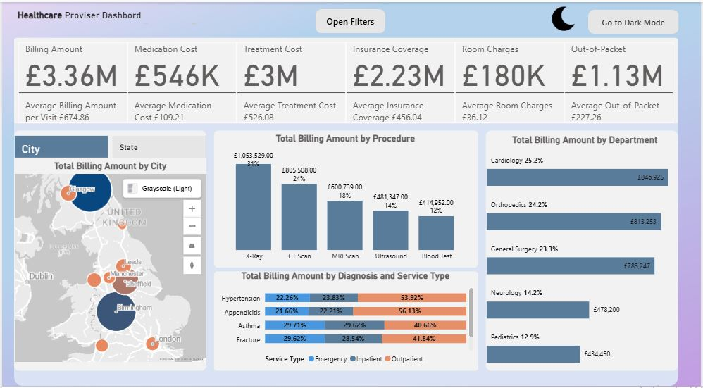
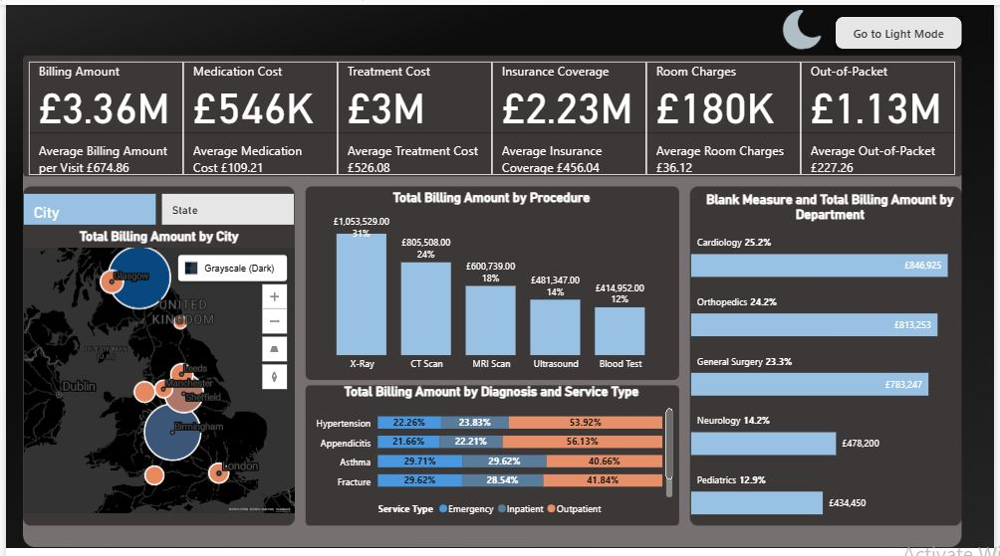
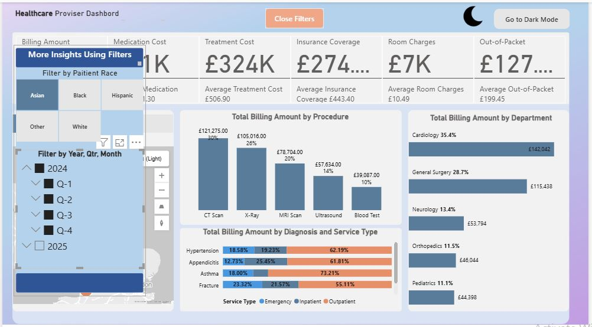

# Healthcare Analytics Dashboard – Version 1

This version establishes the **foundation** of the Healthcare Analytics Dashboard by focusing on data preparation, modeling, and basic visual setup in **Power BI Desktop**.

---

## 🔍 Key Features
- Imported and cleaned the healthcare billing dataset in **Power Query**.  
- Built relationships between fact and dimension tables.  
- Created a **custom Date Table** using DAX to extract Year, Quarter, Month, and Weekday.  
- Developed KPI cards for:
  - Total Billing Amount  
  - Total Treatment Cost  
  - Medication Cost  
  - Insurance Coverage  
  - Out-of-Pocket Expenses  
- Added slicers for **Year**, **Quarter**, and **Patient Race**.  
- Designed a simple layout background using **PowerPoint**.

---

## 📸 Dashboard Preview

**Light Mode**

**Dark Mode**

**Filtered View**

---

## 🧠 Learning Outcome
Strengthened understanding of Power BI data modeling and DAX fundamentals.

---

**Next step:** Integrate custom visuals and advanced DAX measures — see [Version 2](../v2_The_Pulse_Dashboard/README_v2.md).
