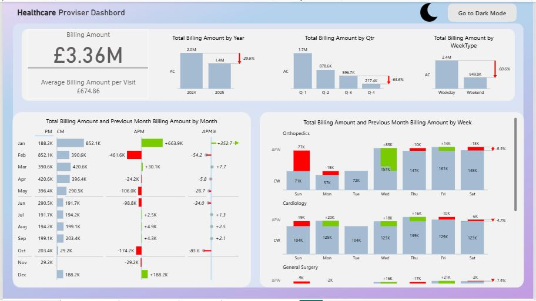
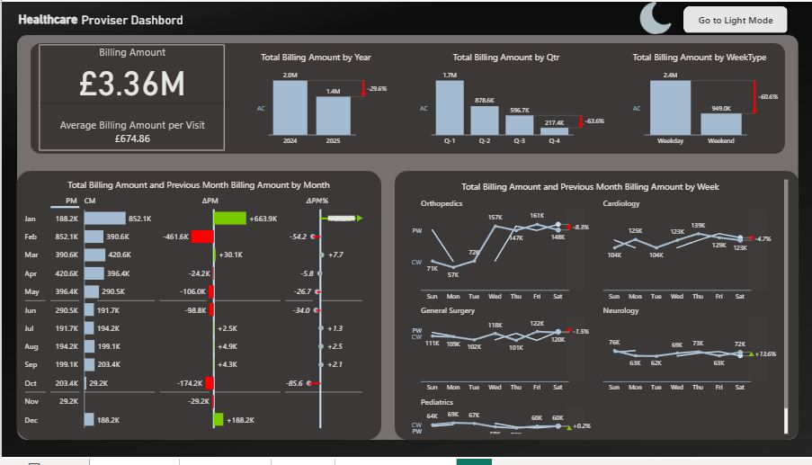

# Healthcare Analytics Dashboard – Version 2

This version expands the project with **advanced analytics, custom visuals, and theme customization** to improve both insight depth and user experience.

---

## ✨ Major Enhancements
- **Two Dashboard Themes:** Created light and dark versions for better usability.  
- **Custom Visuals:** Integrated **Zebra BI Table** and **Zebra BI Cards** to show growth/decline using intuitive visuals.  
- **Advanced DAX:**  
  - Month-over-month and week-over-week billing comparisons.  
  - Custom “Previous Week Billing Amount” logic using `SWITCH` and `CALCULATE`.  
- **Interactive Filters:** Department, City/State, and Patient Race.  
- **Dynamic Labels:** Updated titles to “Previous Month” and “Current Month” for clarity.  
- **Color-coded Indicators:** Green for growth, red for decline.  
- **Dark Mode:** Re-styled visuals and background for readability and aesthetics.

---

## 🧠 Key Takeaways
Mastered time intelligence, theme design, and storytelling through Power BI visuals.  
Demonstrated how healthcare billing data can be communicated through clear, actionable dashboards.

---
## 📸 Dashboard Preview

**Light Mode**

**Dark Mode**

---

Developed by **Majd Ibrahim**  
[LinkedIn Profile](https://www.linkedin.com/in/majd-ibrahim-6a02bb200/)
